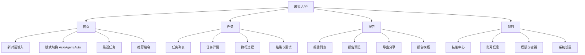
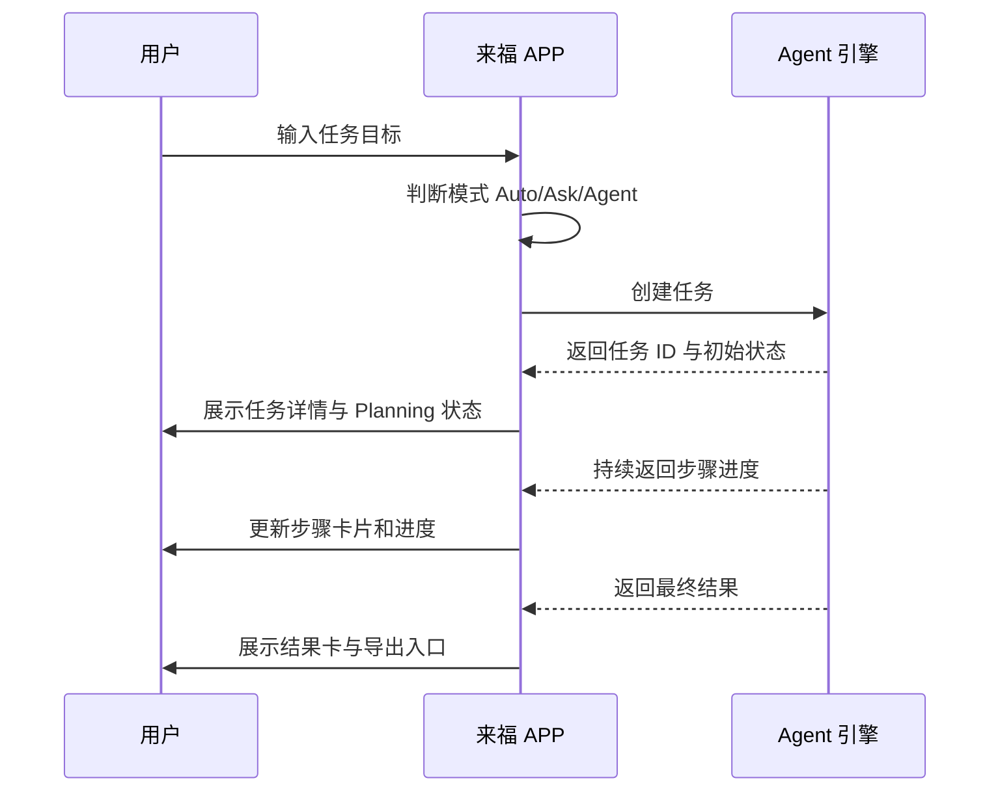

# 来福APP UI交互方案文档_v1

| 文档版本 | v1.0 |
| --- | --- |
| 设计对象 | 来福 APP |
| 参考来源 | v7.0 设计方向、现有产品 PRD、Web 端任务/报告/技能/工作流结构 |
| 输出日期 | 2026-04-19 |
| 文档目标 | 明确来福 APP 的信息架构、核心页面、关键交互、状态反馈与组件规范，为后续原型、视觉稿和研发拆解提供依据 |

## 1. 设计定位

### 1.1 产品一句话
来福 APP 是一个面向个人与团队的 AI 智能体助手，通过对话式任务创建、自动执行、过程追踪、报告沉淀和技能扩展，帮助用户完成调研、分析、写作、流程自动化等复杂任务。

### 1.2 v7.0 设计参考要点
本方案延续 v7.0 的核心设计资产，并针对移动端 APP 使用场景做重组：

| v7.0 设计特征 | APP 方案继承方式 |
| --- | --- |
| 对话框作为主入口 | 首页即输入，支持 Ask / Agent / Auto 模式 |
| 左侧历史任务列表 | 移动端转为「最近任务」抽屉与任务页列表 |
| 任务过程可视化 | 消息流内展示计划、步骤、进度、结果卡片 |
| 卡片式信息承载 | 首页、任务、报告、技能统一使用轻量卡片 |
| 技能系统可配置 | 独立「技能」Tab，支持启用、测试、查看权限 |
| 报告可生成与下载 | 独立「报告」Tab，支持预览、导出、分享 |

### 1.3 设计关键词
- 可信赖：每个长任务都有清晰进度、可追溯过程和失败解释。
- 低门槛：用户无需理解工作流或技能，只需描述目标。
- 可控感：任务执行中可暂停、补充指令、重试、导出结果。
- 专业感：信息密度克制，突出状态、产物和下一步动作。

## 2. 用户与场景

### 2.1 目标用户
| 用户类型 | 典型需求 | 关键痛点 |
| --- | --- | --- |
| 普通用户 | 快速提问、生成文案、整理资料 | 不知道如何拆任务，担心 AI 结果不可控 |
| 高级用户 | 长任务分析、报告生成、批量处理 | 需要看过程、追状态、复用历史任务 |
| 企业用户 | 业务流程自动化、团队知识沉淀 | 需要权限、审计、稳定产出与标准格式 |

### 2.2 核心使用场景
1. 用户在首页输入一个目标，例如「帮我分析某行业趋势并生成报告」。
2. APP 判断为 Agent 长任务，生成执行计划并开始运行。
3. 用户在消息流中查看任务步骤、进度、日志摘要和阶段产物。
4. 任务完成后生成报告，用户可预览、编辑、导出或分享。
5. 用户可在技能页查看已启用能力，如网页搜索、文件读取、数据分析等。

## 3. 信息架构

### 3.1 一级导航
APP 采用底部 4 Tab 架构：

| Tab | 名称 | 目标 |
| --- | --- | --- |
| 首页 | 来福 | 对话式创建任务、快速问答、查看最近会话 |
| 任务 | 任务 | 管理长任务、查看执行状态和历史 |
| 报告 | 报告 | 查看、生成、预览、导出报告 |
| 我的 | 我的 | 技能、设置、账号、用量与权限管理 |

### 3.2 二级结构

## 4. 全局交互原则

### 4.1 输入优先
首页不做复杂营销页，首屏直接提供输入框、模式切换和快捷指令，让用户一进入 APP 就能开始。

### 4.2 过程透明
Agent 长任务必须展示：
- 任务理解结果
- 执行计划
- 当前步骤
- 关键中间产物
- 异常原因与可选动作

### 4.3 状态可恢复
APP 退出或切换页面后，任务继续运行。再次进入时自动恢复到任务详情，并标记未读更新。

### 4.4 操作可撤回
删除任务、停止执行、覆盖报告、清空历史等高风险动作需要二次确认。

### 4.5 轻量学习成本
高级概念如「技能」「工作流」「执行策略」默认不外露，优先用用户可理解的动作命名，例如「联网搜索」「读取文件」「生成报告」。

## 5. 视觉与组件方向

### 5.1 视觉基调
| 项目 | 方案 |
| --- | --- |
| 主色 | 来福蓝 #2563EB，用于主按钮、选中态、关键进度 |
| 成功色 | #16A34A |
| 警告色 | #F59E0B |
| 失败色 | #DC2626 |
| 背景色 | #F8FAFC |
| 主文字 | #0F172A |
| 次文字 | #64748B |
| 分割线 | #E2E8F0 |

### 5.2 字体与字号
| 层级 | 字号 | 字重 | 用途 |
| --- | --- | --- | --- |
| 大标题 | 24px | 700 | 首页欢迎语、详情标题 |
| 页面标题 | 20px | 700 | Tab 页面标题 |
| 卡片标题 | 16px | 600 | 任务、报告、技能卡片 |
| 正文 | 14px | 400 | 描述、消息正文 |
| 辅助信息 | 12px | 400 | 时间、状态、说明 |

### 5.3 基础组件
| 组件 | 规则 |
| --- | --- |
| 顶部栏 | 左侧页面标题，右侧搜索/更多；详情页左侧返回 |
| 底部 Tab | 4 个入口，支持角标提示任务更新 |
| 主按钮 | 高 44px，圆角 8px，实心蓝 |
| 次按钮 | 高 40px，圆角 8px，白底描边 |
| 输入框 | 支持多行、自适应高度、发送按钮固定右下 |
| 卡片 | 圆角 8px，白底，轻描边，不使用厚重阴影 |
| 状态标签 | pending/running/completed/failed 使用固定颜色映射 |
| 进度条 | 用于长任务详情，显示百分比或阶段进度 |
| 底部弹层 | 用于模式选择、导出格式、更多操作 |
| Toast | 用于轻提示，2 秒自动消失 |
| Dialog | 用于风险确认，必须提供取消按钮 |

## 6. 核心页面方案

### 6.1 首页「来福」

#### 页面目标
让用户最快开始一次问答或长任务，并能回到最近的任务上下文。

#### 页面结构
1. 顶部：Logo「来福」+ 通知/历史入口。
2. 欢迎区：根据时间显示「今天想让来福帮你做什么？」
3. 主输入区：多行输入框 + 发送按钮。
4. 模式切换：Auto / Ask / Agent。
5. 快捷指令：调研分析、生成报告、整理文件、写方案。
6. 最近任务：显示 3 条最近运行或完成任务。

#### 关键交互
| 触发 | 交互结果 |
| --- | --- |
| 输入后点击发送 | 根据模式进入问答流或创建任务 |
| Auto 模式 | 系统按文本长度、关键词和复杂度判断 Ask/Agent |
| Ask 模式 | 当前页进入即时对话，不创建长任务 |
| Agent 模式 | 创建任务，进入任务详情执行流 |
| 点击最近任务 | 跳转任务详情 |
| 点击历史入口 | 右侧或底部弹出历史任务抽屉 |

#### 空状态文案
标题：今天想让来福帮你做什么？  
输入占位：描述你的目标，来福会帮你拆解并执行

### 6.2 对话/任务执行页

#### 页面目标
承载 Ask 即时问答和 Agent 长任务过程，形成统一的消息体验。

#### 页面结构
1. 顶部：任务名/会话名 + 状态点 + 更多。
2. 消息流：用户消息、AI 回复、计划卡、步骤卡、结果卡。
3. 过程面板：运行中显示当前步骤、耗时、可暂停按钮。
4. 底部输入：支持补充指令、继续追问、上传附件。

#### 消息类型
| 类型 | 展示方式 |
| --- | --- |
| 用户消息 | 右侧气泡，深色背景 |
| AI 普通回复 | 左侧气泡，白底描边 |
| 计划卡 | 卡片列出步骤，当前步骤高亮 |
| 执行步骤 | 时间线样式，支持展开查看日志摘要 |
| 结果卡 | 展示报告、表格、文件、链接等产物 |
| 错误卡 | 红色状态，解释失败原因，提供重试/修改指令 |

#### 运行中交互
| 操作 | 规则 |
| --- | --- |
| 暂停任务 | 点击后弹出确认，暂停后可继续执行 |
| 补充指令 | 用户输入补充要求，系统插入到后续步骤 |
| 查看日志 | 步骤卡展开，默认展示摘要，不暴露过多技术日志 |
| 后台运行 | 用户离开页面后继续运行，Tab 角标提示更新 |

### 6.3 任务列表页

#### 页面目标
管理所有 Agent 长任务，帮助用户快速筛选、续看、重试。

#### 页面结构
1. 顶部：标题「任务」+ 搜索。
2. 状态筛选：全部、运行中、已完成、失败。
3. 任务列表：任务名、状态、创建时间、进度、产物数量。
4. 浮动按钮：新建任务。

#### 任务卡片字段
| 字段 | 说明 |
| --- | --- |
| 任务名 | 用户输入前 30 字或手动命名 |
| 状态 | pending/running/completed/failed |
| 进度 | 运行中显示步骤进度 |
| 更新时间 | 最近状态更新时间 |
| 快捷动作 | 继续查看、重试、导出结果 |

#### 交互状态
| 状态 | 表现 |
| --- | --- |
| pending | 灰色标签「等待中」 |
| running | 蓝色标签「执行中」+ 动态进度 |
| completed | 绿色标签「已完成」 |
| failed | 红色标签「失败」+ 重试入口 |

### 6.4 任务详情页

#### 页面目标
让用户完整理解一个任务从需求、计划、执行到产出的全过程。

#### 页面结构
1. 任务概览：任务名、状态、耗时、创建时间。
2. 执行计划：步骤列表，支持展开。
3. 当前进度：当前节点、剩余步骤、运行时长。
4. 产物区域：报告、文件、数据表、引用资料。
5. 操作区：继续对话、导出、重试、删除。

#### 关键交互
- 点击步骤：展开查看输入、动作、输出摘要。
- 点击产物：打开报告预览或文件详情。
- 点击重试：可选择「从失败步骤重试」或「重新执行全部」。
- 点击导出：底部弹层选择 PDF、Word、Markdown。

### 6.5 报告列表页

#### 页面目标
集中管理任务沉淀的报告，并支持快速预览、导出、分享。

#### 页面结构
1. 顶部：标题「报告」+ 搜索。
2. 分类筛选：全部、最近生成、已收藏、已分享。
3. 报告卡片：标题、来源任务、生成时间、格式、摘要。
4. 空状态：引导从首页或任务生成报告。

#### 关键交互
| 操作 | 反馈 |
| --- | --- |
| 点击报告 | 进入报告预览 |
| 长按报告卡 | 唤起批量选择 |
| 点击下载 | 选择导出格式 |
| 点击分享 | 系统分享面板 |
| 收藏报告 | 卡片右上角星标高亮 |

### 6.6 报告预览页

#### 页面目标
在移动端提供清晰阅读和轻编辑能力。

#### 页面结构
1. 顶部：返回、标题、更多。
2. 报告正文：目录、章节、图表、引用。
3. 底部操作栏：编辑、导出、分享。

#### 交互规则
- 目录默认收起，点击悬浮目录按钮展开。
- 长报告支持章节锚点跳转。
- 编辑模式只开放标题、摘要、章节文字的轻编辑。
- 导出前提示格式与文件大小。

### 6.7 我的页

#### 页面目标
承载账号、技能、用量、权限、系统设置。

#### 页面结构
1. 用户信息：头像、昵称、会员状态。
2. 用量概览：今日任务数、报告数、剩余额度。
3. 功能入口：技能中心、权限管理、数据与隐私、设置。
4. 帮助入口：使用指南、反馈、关于来福。

### 6.8 技能中心

#### 页面目标
让高级用户理解和管理来福可调用的能力。

#### 页面结构
1. 技能分类：全部、内置、已启用、需授权。
2. 技能卡片：名称、描述、类型、启用状态。
3. 技能详情：参数说明、权限说明、测试入口。

#### 关键交互
| 操作 | 规则 |
| --- | --- |
| 启用技能 | 若需授权，先进入授权流程 |
| 停用技能 | 二次确认，提示可能影响工作流 |
| 测试技能 | 输入 JSON 或表单化参数，展示运行结果 |
| 查看权限 | 展示技能可访问的数据范围 |

## 7. 核心流程

### 7.1 新建长任务流程

### 7.2 即时问答流程
1. 用户在首页选择 Ask 或 Auto 判断为 Ask。
2. 用户发送问题。
3. APP 在当前会话中返回回答。
4. 用户继续追问。
5. 当用户提出「生成报告」「执行」「整理文件」等复杂请求时，提示是否升级为 Agent 任务。

### 7.3 报告生成流程
1. 用户从任务结果点击「生成报告」。
2. 选择报告模板或默认模板。
3. 系统生成报告草稿。
4. 用户预览并轻编辑。
5. 导出 PDF / Word / Markdown 或分享。

### 7.4 失败重试流程
1. 任务失败后展示错误卡。
2. 错误卡说明：失败阶段、可能原因、建议操作。
3. 用户选择「从失败步骤重试」「修改指令后重试」「终止任务」。
4. 重试后保留原历史，并生成新的执行分支记录。

## 8. 状态与反馈规范

### 8.1 加载状态
| 场景 | 表现 |
| --- | --- |
| 首页发送中 | 发送按钮转 loading |
| 任务创建中 | 显示「正在理解任务」 |
| Planning | 计划卡骨架屏 |
| 步骤执行中 | 当前步骤蓝色高亮 + 动态点 |
| 报告生成中 | 进度条 + 当前章节生成提示 |

### 8.2 空状态
| 页面 | 文案 |
| --- | --- |
| 任务空 | 还没有任务，描述一个目标让来福开始执行 |
| 报告空 | 还没有报告，完成任务后可以一键生成 |
| 技能空 | 暂无可用技能，请稍后再试 |
| 搜索无结果 | 没找到相关内容，换个关键词试试 |

### 8.3 错误状态
| 场景 | 文案与动作 |
| --- | --- |
| 网络失败 | 网络连接异常，请检查后重试 |
| 创建任务失败 | 任务创建失败，请稍后重试 |
| 执行失败 | 当前步骤执行失败，可重试或修改指令 |
| 导出失败 | 文件导出失败，请稍后再试 |
| 授权失效 | 授权已失效，请重新连接 |

## 9. 权限与安全交互

### 9.1 权限申请
技能需要访问外部服务、文件、相册或系统分享时，必须先说明用途：
- 联网搜索：用于获取实时公开信息。
- 文件读取：用于分析用户选择的文件。
- 相册访问：用于上传图片作为任务输入。
- 通知权限：用于任务完成或失败提醒。

### 9.2 隐私提示
上传文件、调用外部 API、分享报告前，展示明确提示：
- 将使用该内容完成当前任务。
- 不会在未确认的情况下分享给第三方。
- 用户可在「数据与隐私」中删除历史记录。

## 10. 移动端适配规则

### 10.1 iOS / Android 通用规则
- 底部 Tab 避开系统安全区域。
- 输入框弹起键盘时，发送按钮保持可见。
- 长任务页支持下拉刷新状态。
- 任务步骤、报告目录等长内容支持吸顶锚点。

### 10.2 手势
| 手势 | 作用 |
| --- | --- |
| 右滑返回 | 从详情页返回列表 |
| 下拉刷新 | 更新任务状态 |
| 长按报告卡 | 进入多选 |
| 左滑任务卡 | 显示删除/归档 |
| 点击状态标签 | 展开状态说明 |

## 11. 埋点建议

| 事件 | 触发时机 | 关键参数 |
| --- | --- | --- |
| app_home_view | 打开首页 | user_id, source |
| task_create_click | 点击发送并创建任务 | mode, text_length |
| task_created | 创建成功 | task_id, mode |
| task_step_view | 查看步骤详情 | task_id, step_id |
| task_retry_click | 点击重试 | task_id, retry_type |
| report_export_click | 点击导出 | report_id, format |
| skill_enable_click | 启用技能 | skill_name, auth_required |

## 12. MVP 范围

### 12.1 v1 必做
- 首页对话输入
- Ask / Agent / Auto 模式切换
- 创建任务
- 任务列表
- 任务详情与执行步骤
- 报告列表与预览
- 报告导出入口
- 我的页基础信息
- 技能中心列表与详情

### 12.2 v1 可延后
- 工作流可视化编辑器
- 多人协作
- 批量任务
- 自定义报告模板
- 深度技能参数编辑
- 团队权限管理

## 13. 原型页面清单

| 编号 | 页面 | 优先级 |
| --- | --- | --- |
| P0-01 | 首页/新对话 | P0 |
| P0-02 | 对话执行页 | P0 |
| P0-03 | 任务列表页 | P0 |
| P0-04 | 任务详情页 | P0 |
| P0-05 | 报告列表页 | P0 |
| P0-06 | 报告预览页 | P0 |
| P1-01 | 我的页 | P1 |
| P1-02 | 技能中心 | P1 |
| P1-03 | 技能详情/授权 | P1 |
| P1-04 | 设置页 | P1 |

## 14. 研发交付说明

### 14.1 前端关键能力
- 支持任务状态轮询或 WebSocket 推送。
- 消息流组件需支持多类型卡片渲染。
- 报告预览需支持 Markdown/结构化 JSON 渲染。
- 本地缓存最近任务与最近会话，提升回访速度。
- 长任务后台运行时支持通知提醒。

### 14.2 后端接口依赖
| 模块 | 接口能力 |
| --- | --- |
| 任务 | 创建、列表、详情、暂停、恢复、重试、删除 |
| 对话 | 发送消息、获取历史、升级为任务 |
| 报告 | 列表、详情、生成、导出、分享 |
| 技能 | 列表、详情、启用、停用、测试、授权 |
| 用户 | 资料、额度、设置、隐私数据删除 |

## 15. 待确认问题

1. 「来福」品牌视觉是否已有 Logo、吉祥物或固定品牌色。
2. v7.0 是否存在独立视觉稿，若有需进一步对齐页面布局和组件样式。
3. APP 首版是否需要登录注册流程。
4. 报告导出格式是否首版即支持 PDF、Word、Markdown 全量。
5. 技能中心是否面向普通用户开放，还是仅高级用户可见。

