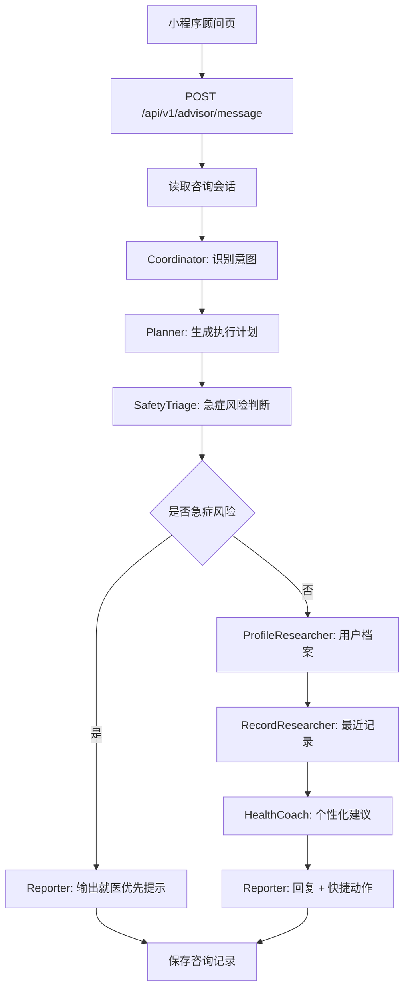

# 来福健康咨询 Agent - DeerFlow 架构方案

## 目标

在来福小程序的“顾问”页面中构建一个健康咨询 Agent。当前版本采用轻量 DeerFlow 风格实现，先保证本地 FastAPI 后端可运行、可部署、可被小程序直接调用；后续可平滑升级为 LangGraph/DeerFlow 运行时。

## 架构映射

DeerFlow 的核心思想是把复杂任务拆成多个节点，由入口协调、规划节点拆解、专门 Agent 执行，最后汇总输出。来福健康咨询 Agent 的映射如下：

| DeerFlow 角色 | 来福实现 | 职责 |
| --- | --- | --- |
| Coordinator | `DeerFlowHealthAgent._coordinate` | 接收用户问题，识别咨询意图 |
| Planner | `DeerFlowHealthAgent._plan` | 拆解安全判断、档案检索、记录分析、建议生成 |
| Researcher | `_research_profile` / `_research_records` | 读取用户档案和最近健康记录 |
| Safety Agent | `_triage_safety` | 判断急症风险和持续异常风险 |
| Health Coach | `_coach` | 生成饮食、运动、血压、血糖、睡眠等建议 |
| Reporter | `_report` | 汇总成小程序可展示的话术和快捷按钮 |

## 当前落地文件

- `backend/app/agents/deerflow_health.py`
- `backend/app/services.py`
- `backend/app/main.py`

## 交互流程

## 安全边界

健康咨询 Agent 只提供健康管理建议，不替代医生诊断。遇到胸痛、呼吸困难、意识异常、疑似卒中、血压高于 180/120、血糖显著异常等风险时，优先提示用户尽快就医或联系急救。

## 后续升级方向

1. 接入真实 LLM，节点内从规则回复升级为模型推理。
2. 引入 LangGraph，把当前方法节点迁移为可观测、可流式输出的图节点。
3. 增加医学知识库 RAG，但只使用权威来源，并标注来源和更新时间。
4. 将 Agent trace 存入咨询记录，便于排查回复路径。
5. 增加风险分级字段，让前端可展示“普通建议 / 需关注 / 尽快就医”的视觉状态。

